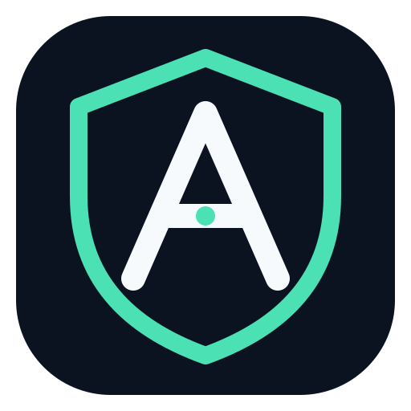
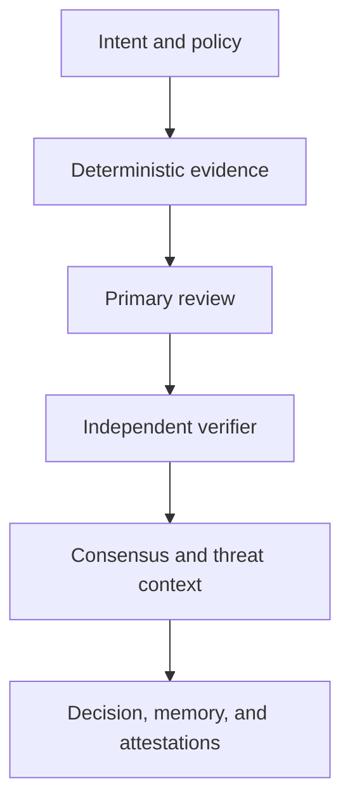

<p align="center">
  
</p>

<h1 align="center">Aegis</h1>

<p align="center"><strong>Trust infrastructure for software agents</strong></p>

AI agents can write code, call tools, modify repositories, and trigger real
systems. The difficult question is no longer whether an agent can act. It is
whether that action was allowed, whether its evidence can be inspected, and
whether the result can be trusted after the agent is gone.

Aegis sits between intent and action. It gives security-sensitive work an
explicit plan, bounded permissions, deterministic evidence, independent
verification, an audit trail, a final policy decision, and memory that survives
the run.

`0.2.0` is the first end-to-end preview of that system. It applies the Aegis
trust model to software security through a VS Code extension, GitHub Action,
CLI, and local orchestration backend.

## A trust layer, not another scanner

A scanner can identify a suspicious line. It cannot, by itself, establish
whether an agent was authorized to act, which evidence shaped a decision,
whether another model agreed, whether the behavior reproduced safely, whether
a patch closed the original path, or whether the result should change future
policy.

Aegis keeps those questions separate:

| Question | Aegis record |
|---|---|
| What was requested? | Operation, source revision, task graph, and policy profile |
| Was it allowed? | Explicit gates, authorization scope, and execution limits |
| What supports the claim? | Scanner evidence, source locations, model review, and provenance |
| Was it independently checked? | Verifier route, verdict, confidence, and deterministic consensus |
| Is the attack path credible? | Threat context and separately authorized dynamic evidence |
| Did the fix work? | Exact patch digest, project checks, static rescan, and baseline replay |
| Can the result be trusted later? | Append-only audit events, SHA-256 attestations, and project security memory |

No single model, scanner, or absence of an error is allowed to prove the whole
workflow.

## What a real run produces

The packaged `0.2.0` extension was exercised against the checked-in vulnerable
SQL fixture. The run completed all eight production tasks:

| Result | Observed value |
|---|---|
| Deterministic evidence | Semgrep and Bandit |
| Primary review | `openai/gpt-oss-20b` |
| Independent verifier | `mistralai/mistral-medium-3.5-128b` |
| Consensus | Confirmed, 99% confidence |
| Policy | `REVIEW`, risk 75/100 |
| Task graph | 8 completed, 0 failed, 0 blocked |
| Integrity | Source, plan, audit, and artifact manifest verified |
| Memory | New confirmed claim stored in the local project snapshot |

`REVIEW` is the expected result: the fixture contains an active high-severity
SQL injection claim. Aegis preserved the evidence and asked for a human
decision instead of presenting vulnerable code as clean.

## The trust workflow



Controlled validation and secure fixes extend the same chain. They remain
separately authorized because analyzing code is not permission to execute it,
and proposing a patch is not proof that the patch is correct.

### Verification outcomes

- `VERIFIED` means the required project checks passed, the target finding
  disappeared, no static regression appeared, and an authorized baseline no
  longer reproduces.
- `PARTIAL` means available checks passed but the evidence is not sufficient
  for a verified claim.
- `FAILED` means the issue remains, a check failed, a regression appeared, or
  execution could not support a trustworthy conclusion.

### Policy outcomes

- `ALLOW` means the configured policy accepts the evidence and risk.
- `REVIEW` means a person must resolve an active claim, incomplete evidence, or
  a policy threshold.
- `BLOCK` means a blocking condition exists or a required trust boundary could
  not be preserved.

A blocked, cancelled, failed, or timed-out run never becomes proof of safety.

## Product surfaces

### VS Code extension

The extension is the interactive Aegis workspace. It can:

- scan a selection, file, Git change set, dependency set, or workspace
- display canonical claims and their evidence nodes
- show primary and verifier routes, consensus, and threat context
- preview a task graph without executing it
- request explicit authorization for controlled validation
- open a reviewable patch and verify the result
- run Trusted Analysis and display policy, memory, audit, and integrity data

Repository commands are disabled in untrusted and virtual workspaces. The
extension connects to the local backend at `http://127.0.0.1:8000` by default.

### GitHub Action

The pull-request gate evaluates changed files without executing repository
code. It returns `ALLOW`, `REVIEW`, or `BLOCK` and writes JSON, repository policy
evidence, and SARIF.

```yaml
name: Aegis

on:
  pull_request:

permissions:
  contents: read
  security-events: write

jobs:
  security:
    runs-on: ubuntu-latest
    steps:
      - uses: actions/checkout@v6
        with:
          fetch-depth: 0

      - uses: lemkyz/Aegis@v0.2.0
        with:
          base: ${{ github.event.pull_request.base.sha }}
          head: ${{ github.event.pull_request.head.sha }}
```

Artifacts:

- `aegis-change-gate.json`
- `aegis-policy-check.json`
- `aegis-results.sarif`

### CLI and local backend

The same deterministic policy path is available from the `aegis` CLI. The
FastAPI backend coordinates production task execution, model routes, threat
models, validation, fixes, policy, memory, and audit records.

## Local setup

Requirements:

- Python 3.14
- Semgrep
- Podman or Docker for explicitly authorized dynamic validation

```bash
git clone https://github.com/lemkyz/Aegis.git
cd Aegis/backend

python -m venv .venv
source .venv/bin/activate
pip install -e ".[dev]"

export AEGIS_FINGERPRINT_KEY="$(
  python -c 'import secrets; print(secrets.token_urlsafe(48))'
)"

uvicorn aegis.main:app --host 127.0.0.1 --port 8000
```

Check the service:

```bash
curl http://127.0.0.1:8000/health
```

Install the release VSIX, open a trusted local workspace, and run
**Aegis: Run Trusted Analysis** from the Command Palette.

Deterministic workflows do not require a model provider. For model-backed
review, copy [`backend/.env.example`](backend/.env.example) and configure the
primary and verifier routes deliberately.

## Data and permission boundaries

Aegis does not include product telemetry.

Deterministic scans, project security memory, policy evaluation, and audit
records remain local when Aegis runs through VS Code. If model-backed review is
enabled, Aegis sends the configured provider the source context and evidence
required for that request, after applying its secret-redaction boundary. The
report records which provider and model handled each role.

Dynamic validation is never implicit. Its local container boundary includes:

- a read-only repository mount and container root
- networking disabled by default
- dropped Linux capabilities and `no-new-privileges`
- an unprivileged user
- CPU, memory, process, runtime, and output limits
- no shell-based container command construction

Secure fixes are bound to the reviewed patch digest and source selection. Aegis
revalidates both before writing, replaces the source atomically, and does not
overwrite newer user work during rollback.

Use validation only on repositories and systems you own or are explicitly
authorized to test.

## Integrity and memory

Every production run has a task graph and append-only audit trail. Trusted
Analysis binds the source, plan, audit stream, and artifact manifest with
SHA-256 digests. Repository revision drift, source changes, missing evidence,
and incomplete verification remain visible.

Project security memory stores immutable snapshots and claim transitions such
as new, persistent, changed, resolved, and reopened. Partial or failed analysis
is never written as a clean baseline.

## Current scope and direction

What exists in `0.2.0`:

- production security-task planning and execution
- deterministic specialist analysis
- primary review, independent verification, and consensus
- claim-centric evidence and threat context
- controlled validation
- transactional secure fixes and fix verification
- project security memory and deterministic policy output
- VS Code, GitHub Action, CLI, and local API surfaces

What this foundation is being extended toward:

- agent identity and capability-based permissions
- action interception before tools touch real systems
- least-privilege filesystem, process, and egress controls
- rollback and recovery for agent actions
- organization and CI policy enforcement
- persistent agent trust history
- multi-agent oversight and an Aegis control plane

The long-term goal is not a larger vulnerability scanner. It is a common trust
layer for autonomous software agents.

## Development and release verification

Run the complete gate from the repository root:

```bash
./scripts/run-release-readiness.sh
```

The gate covers backend tests, real-repository acceptance cases, a live API,
installed-wheel and CLI smoke scenarios, extension tests, VSIX packaging, and
package inspection.

Read [the release checklist](docs/RELEASE_CHECKLIST.md), the
[security policy](SECURITY.md), and [contribution guide](CONTRIBUTING.md)
before shipping a change.

## Status

`0.2.0` is a preview. Public interfaces may change before `1.0`, and the current
release should be evaluated on local or non-production repositories first.

## License

Apache License 2.0. See [LICENSE](LICENSE) and [NOTICE](NOTICE).
