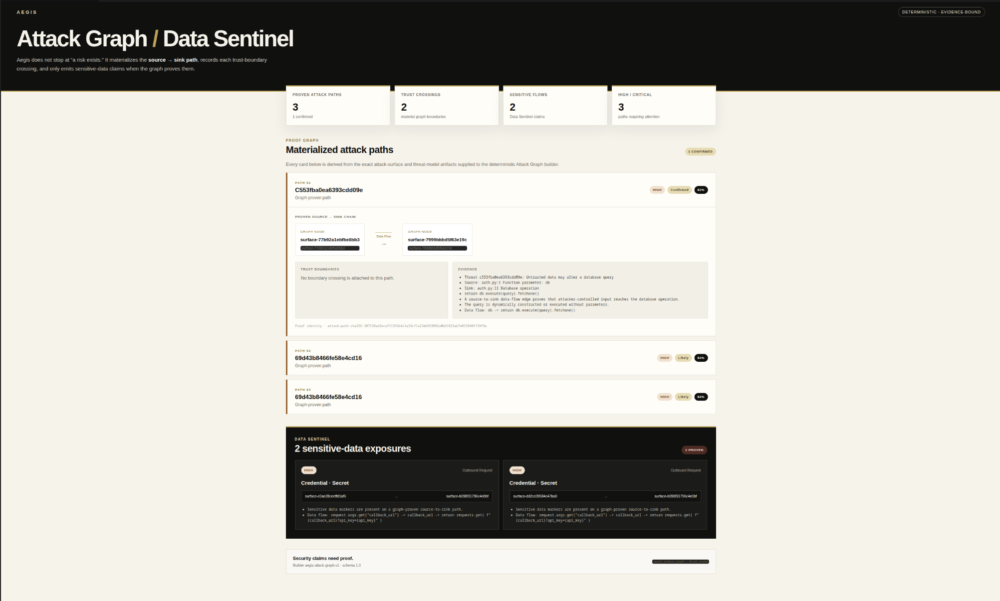
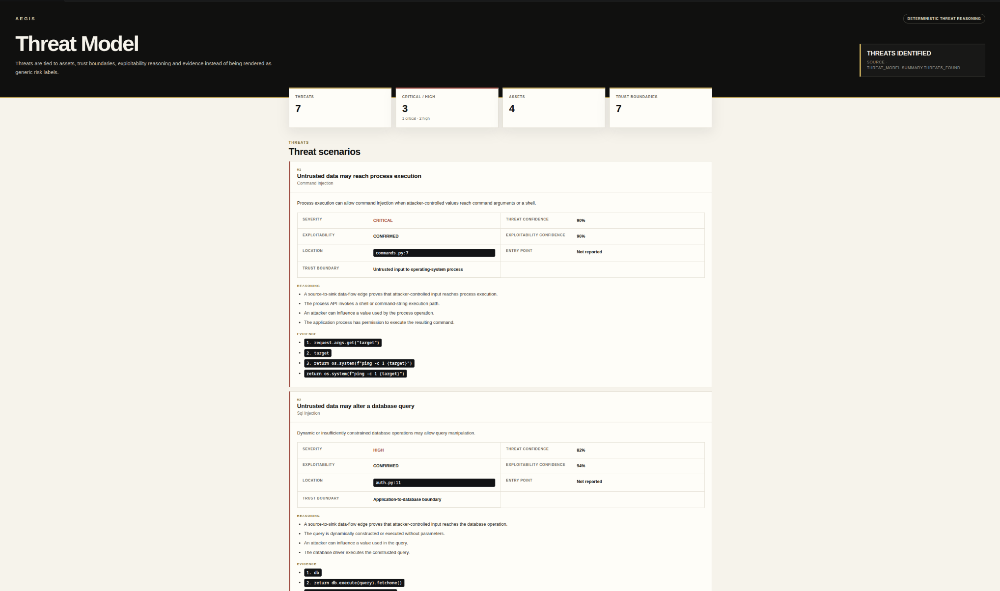
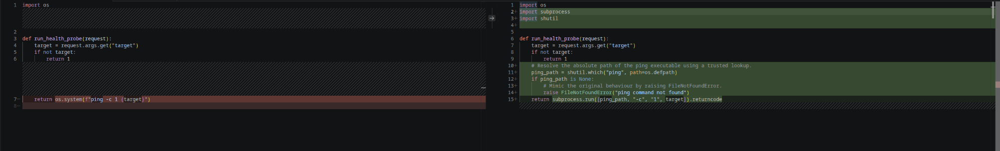
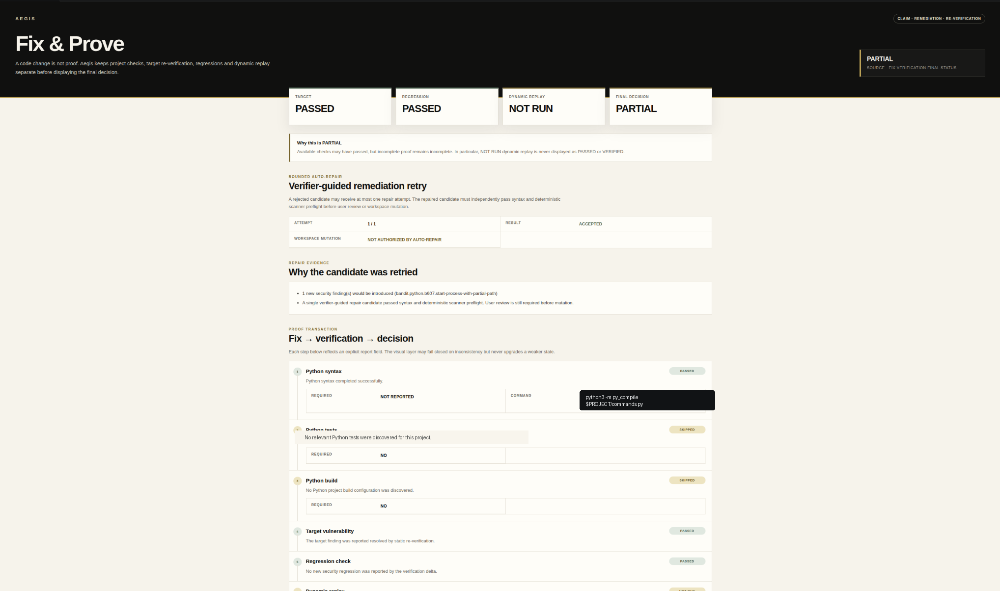
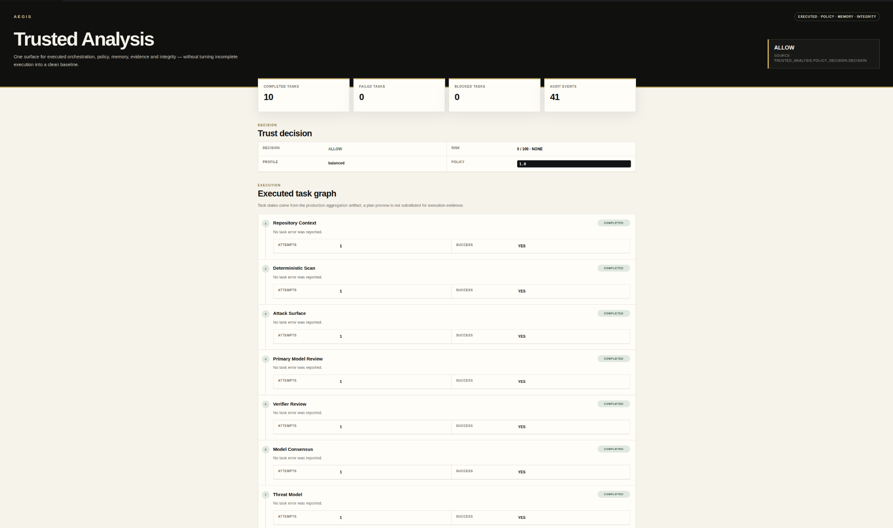
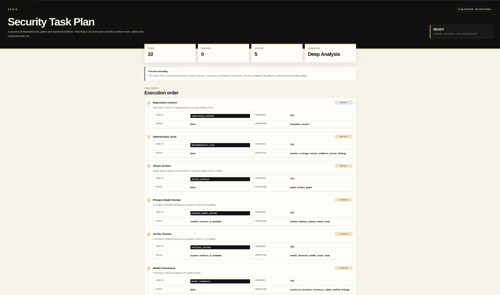

# AEGIS

**Trust infrastructure for software and AI agents.**

**Security claims need proof.**

[Website](https://aegistrustlayer.com) ·
[VS Code Marketplace](https://marketplace.visualstudio.com/items?itemName=aegis-security.aegis-security) ·
[LinkedIn](https://www.linkedin.com/company/aegis-trust-layer/) ·
[Runtime releases](https://github.com/lemkyz/Aegis/releases) ·
[Security](SECURITY.md)

---

Software can now propose changes, call tools, and act faster than human review can safely absorb.

Aegis sits between a security-sensitive action and the decision to trust it.

It turns that decision into an inspectable sequence:

**CLAIM → EVIDENCE → VERIFICATION → DECISION**

A finding is not proof.

A generated patch is not verification.

**The model proposing a security-sensitive change does not get to certify itself.**

Incomplete evidence stays incomplete.

---

## See the attack path, not just the alert



### Attack Graph / Data Sentinel

Aegis materializes security-relevant source-to-sink paths and keeps the evidence around them visible.

The graph can preserve:

- source and sink identity;
- trust-boundary crossings;
- exploitability state;
- high and critical attack paths;
- sensitive-data exposures;
- evidence attached to each path.

The goal is not to turn a repository into a prettier list of alerts. It is to make the security path inspectable.

---

## Reason in repository context



### Threat Model

Aegis ties threats to assets, code locations, trust boundaries, exploitability reasoning, and evidence.

Confidence is not proof. A threat can remain confirmed, likely, possible, or unsupported without being silently promoted into a stronger claim.

---

## Remediate without silently mutating the workspace



### Secure Fix

Aegis can propose a bounded remediation and show the exact change before workspace mutation.

Security-sensitive fixes are not accepted merely because a model produced plausible code. Candidate changes are checked before mutation, and a candidate that introduces a deterministic security regression can be rejected before it reaches the workspace.

---

## Fix & Prove



A patch application is not proof that the original condition disappeared.

Fix & Prove keeps distinct:

- target re-verification;
- regression verification;
- dynamic replay;
- rollback state;
- the final trust decision.

In the example above, target verification passed and regression verification passed, but dynamic replay did not run. The result therefore remained **PARTIAL**.

**NOT RUN is never presented as PASSED or VERIFIED.**

Aegis also supports a strictly bounded verifier-guided repair retry when an initial candidate is rejected before mutation. A repaired candidate must independently pass its preflight checks before it can be shown for review.

---

## Trusted Analysis



Trusted Analysis combines the executed task graph, policy outcome, project security state, audit evidence, and integrity state without substituting planned work for executed evidence.

The UI is a projection of canonical artifacts. It does not promote skipped, blocked, failed, unavailable, or incomplete evidence into proof.

---

## Plan first. Execute only through authorization.



The Security Task Plan exposes dependencies, gates, expected artifacts, and execution order **without executing the plan**.

Planning is not execution.

That separation matters more as software and AI agents take increasingly security-sensitive actions.

---

## Trust model

| Boundary | What Aegis preserves |
|---|---|
| **Claim** | What is being asserted, where, and against which source identity |
| **Evidence** | Deterministic findings, provenance, code locations, and supporting context |
| **Authorization** | What execution or mutation was explicitly permitted |
| **Remediation** | The exact reviewed change and its identity |
| **Verification** | Checks that do not let the proposing model become the sole certification authority |
| **Policy** | Explicit `ALLOW`, `REVIEW`, or `BLOCK` outcomes |
| **Memory** | Persistent security state and audit evidence |

Missing proof stays missing. A failed check does not become a clean result.

---

## Install

Install Aegis from the Visual Studio Marketplace:

```bash
code --install-extension aegis-security.aegis-security
```

Then open a trusted workspace and run Aegis from the Command Palette.

The VS Code extension uses a managed local runtime bound to loopback. The current public runtime preview is distributed as signed native x64 artifacts for Linux, macOS, and Windows.

The managed runtime path is designed around:

- a pinned public runtime release;
- a signed v2 runtime manifest;
- Ed25519 signature verification;
- SHA-256 verification before extraction;
- bounded downloads;
- restrictive local installation permissions;
- health verification before readiness.

See [runtime releases](https://github.com/lemkyz/Aegis/releases) and [runtime documentation](docs/RUNTIME.md).

---

## Truth semantics

### Verification

- **VERIFIED** — required verification evidence supports the claim.
- **PARTIAL** — available checks may have passed, but required proof is incomplete.
- **FAILED** — the issue remains, a required check failed, a regression appeared, or the workflow cannot support a trustworthy conclusion.

Unknown or missing evidence fails closed.

### Policy

- **ALLOW** — configured policy accepts the current evidence and risk.
- **REVIEW** — a person must resolve an active claim, incomplete evidence, or policy threshold.
- **BLOCK** — a blocking condition exists or a required trust boundary could not be preserved.

An `ALLOW` policy outcome is not the same thing as a `VERIFIED` security claim.

---

## Local-first boundary

Aegis is designed so the developer-facing runtime can operate locally rather than requiring repositories to be uploaded to an Aegis-hosted scanner.

Model-backed workflows use explicitly configured providers and preserve provider/model provenance in the trust record.

Controlled dynamic validation requires explicit authorization and should only target systems you own or are authorized to test.

---

## Public surface, private engine

This repository is the public developer surface for Aegis:

- product and trust-model documentation;
- integration contracts;
- runtime release artifacts;
- public integration surfaces;
- examples and brand assets;
- security and support information.

The proprietary Aegis engine, orchestration internals, private security intelligence, private rules, evaluation corpus, and private research implementation are **not published here**.

Public visibility is not an open-source grant. See [LICENSE](LICENSE).

---


## Current preview

Aegis is a public preview.

The shipped product today focuses on evidence-backed security verification for software changes. The broader direction is trust infrastructure for increasingly autonomous software and AI agents: explicit authorization, least privilege, evidence, independent verification, recoverability, policy, and memory.

Interfaces and distribution details may change before 1.0.

---

## Security

Do not report vulnerabilities through a public issue.

See [SECURITY.md](SECURITY.md) or contact **security@aegistrustlayer.com**.

---

## Company

- [Aegis website](https://aegistrustlayer.com)
- [VS Code Marketplace](https://marketplace.visualstudio.com/items?itemName=aegis-security.aegis-security)
- [LinkedIn](https://www.linkedin.com/company/aegis-trust-layer/)
- [Contact](https://aegistrustlayer.com/contact)

For design partnerships, enterprise evaluation, research, or investment conversations, use the contact link above.

---

**AEGIS — Security claims need proof.**
