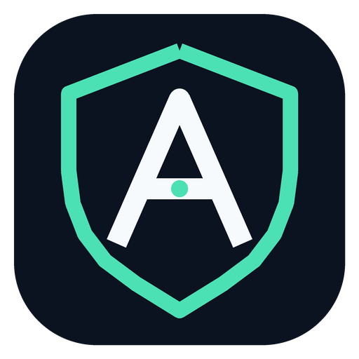

<div align="center">



# Aegis

**Security work you can inspect, replay, and prove.**

[Get started](#get-started) · [How it works](#how-it-works) · [Safety](#safety-boundaries) · [Contributing](CONTRIBUTING.md)

</div>

Aegis is a local trust layer for AI-assisted security work. It records what an analysis used, where a claim came from, which checks agreed, what changed, and whether the original behavior still reproduces after a fix.

It is not another wrapper around “scan, generate a patch, call it done.” Aegis separates planning, evidence collection, model review, authorization, execution, and verification so one step cannot silently vouch for itself.

## What ships today

| Surface | Purpose |
|---|---|
| VS Code extension | Run scans, inspect findings, authorize validation, review patches, and read Trusted Analysis reports |
| GitHub Action | Evaluate pull-request changes as `ALLOW`, `REVIEW`, or `BLOCK` and emit JSON plus SARIF |
| CLI | Run the same deterministic change gate locally or in another CI system |
| Local backend | Coordinate scanners, model routes, threat models, validation, fixes, policy, memory, and audit records |

The VS Code backend and its security memory stay on your machine. Aegis does not include product telemetry. Model-backed analysis uses only the providers you configure.

## Get started

### Run the pull-request gate

```yaml
name: Aegis

on:
  pull_request:

permissions:
  contents: read
  security-events: write

jobs:
  security:
    runs-on: ubuntu-latest
    steps:
      - uses: actions/checkout@v6
        with:
          fetch-depth: 0

      - uses: lemkyz/Aegis@v0.2.0
        with:
          base: ${{ github.event.pull_request.base.sha }}
          head: ${{ github.event.pull_request.head.sha }}
```

The action does not execute repository code. It writes:

- `aegis-change-gate.json`
- `aegis-policy-check.json`
- `aegis-results.sarif`

### Run Aegis locally

Requirements:

- Python 3.14
- Semgrep
- Podman or Docker for authorized dynamic validation

```bash
git clone https://github.com/lemkyz/Aegis.git
cd Aegis/backend

python -m venv .venv
source .venv/bin/activate
pip install -e ".[dev]"

export AEGIS_FINGERPRINT_KEY="$(
  python -c 'import secrets; print(secrets.token_urlsafe(48))'
)"

uvicorn aegis.main:app --host 127.0.0.1 --port 8000
```

Check the service:

```bash
curl http://127.0.0.1:8000/health
```

The VS Code extension connects to `http://127.0.0.1:8000` by default. Install the release VSIX, open a trusted local workspace, and run **Aegis: Run Trusted Analysis** from the Command Palette.

Model routes are optional for deterministic workflows. Copy [`backend/.env.example`](backend/.env.example) when you want primary and verifier model review.

## How it works

```text
request
  → policy and authorization
  → deterministic evidence
  → primary review
  → independent verification
  → consensus
  → threat model
  → controlled validation
  → reviewable fix
  → rescan and replay
  → memory, decision, and attestations
```

Every production run has a task graph and append-only audit trail. Trusted Analysis binds the source, plan, audit stream, and artifact manifest with SHA-256 digests. If the file changes during the run, required evidence is missing, verification is not independent, or repository state drifts, Aegis fails closed instead of presenting a clean result.

### Verdicts

- `VERIFIED`: project checks passed, the target finding disappeared, no static regression appeared, and the authorized baseline no longer reproduces.
- `PARTIAL`: available checks passed, but the evidence is not strong enough for a verified claim.
- `FAILED`: the issue remains, a check failed, a regression appeared, or execution could not support a trustworthy conclusion.

### Policy decisions

- `ALLOW`: the configured policy accepts the evidence and risk.
- `REVIEW`: a person must resolve incomplete evidence or a policy threshold.
- `BLOCK`: the run found a blocking condition or could not preserve a required trust boundary.

## Safety boundaries

Dynamic validation is never implicit. It requires an explicit plan and authorization and runs in a hardened local container with:

- a read-only repository mount and container root
- networking disabled by default
- dropped Linux capabilities and `no-new-privileges`
- an unprivileged user
- CPU, memory, process, runtime, and output limits
- no shell-based container command construction

Secure fixes are tied to the exact reviewed patch digest and source selection. Aegis revalidates both before writing, replaces the source atomically, and avoids overwriting newer user work during rollback.

A blocked, failed, cancelled, or timed-out run is not proof of safety. Partial analysis is never stored as a clean project baseline.

Use validation only on repositories and systems you own or are explicitly authorized to test.

## Development

Run the full release gate from the repository root:

```bash
./scripts/run-release-readiness.sh
```

It covers the backend suite, real-repository acceptance tests, live API and installed-wheel smoke tests, CLI policy scenarios, extension tests, VSIX packaging, and package inspection.

See [the release checklist](docs/RELEASE_CHECKLIST.md) for the manual checks and [CONTRIBUTING.md](CONTRIBUTING.md) for development guidance.

## Status

`0.2.0` is the first end-to-end preview of the Aegis trust workflow. Interfaces may still change before `1.0`.

The next milestones extend the same trust model to agent identity, capability-based permissions, action interception, egress control, rollback, and multi-agent oversight.

## License

Apache License 2.0. See [LICENSE](LICENSE) and [NOTICE](NOTICE).
