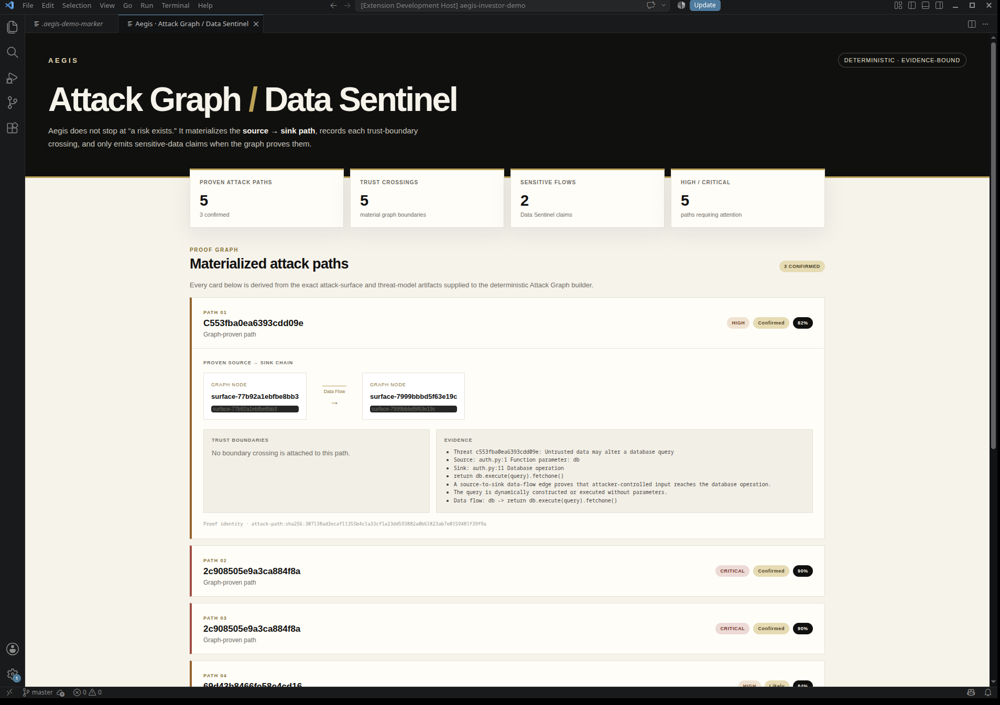
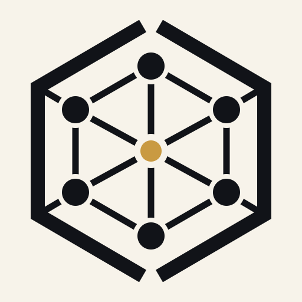

  

<h1 align="center">AEGIS</h1>

  <strong>Trust infrastructure for software agents.</strong>

  <strong>Security claims need proof.</strong>

  
  
  

---

Aegis is a security verification layer for software built and changed with AI.

It does not stop at **"a scanner found something"** or **"the AI says the fix
worked."** Aegis keeps the security claim, supporting evidence, remediation,
and independent verification separate so a team can see what was actually
proved.

## The Aegis loop

| 1. Find | 2. Prove | 3. Fix | 4. Verify |
|---|---|---|---|
| Surface security-sensitive behavior. | Attach evidence to the claim. | Prepare a constrained remediation. | Check the result independently. |

**The system that proposes a fix does not get to certify its own success.**

That principle is the center of Aegis.

## Built for AI-native software teams

Modern teams can ship code faster than they can manually review every
security-sensitive change. Aegis is designed for that gap.

Use it when you need to answer:

- **What security claim is being made?**
- **What evidence supports it?**
- **Can the behavior be reproduced or otherwise validated?**
- **What exactly changed in the remediation?**
- **Did an independent check confirm the result?**
- **What is still unknown or inconclusive?**

Aegis treats **partial**, **unavailable**, and **inconclusive** verification as
different from a verified result.

## Developer surfaces

### VS Code

Work from the editor: inspect findings, review evidence, authorize sensitive
validation, apply approved fixes, and review verification results.

### CLI

Bring the same trust workflow into local development and automation.

### GitHub

Use Aegis around pull requests and release workflows so security-sensitive
changes can carry evidence with them before they ship.

## Quick start

Install the extension from the [VS Code Marketplace](https://marketplace.visualstudio.com/items?itemName=aegis-security.aegis-security).

Then open a project and use the Aegis commands from VS Code.

CLI and GitHub distribution instructions will appear here as those public
release surfaces are finalized.

## What Aegis is not

Aegis is not trying to turn every model response into a security verdict.

It is not a replacement for every security tool a team already uses.

It is a trust layer around security-sensitive software changes: claims should
have evidence, fixes should be constrained, and verification should not depend
on the same system simply declaring itself successful.

## Product

## Evidence over confidence

A result is only useful when a developer can understand the basis for it.

Aegis product surfaces are designed to distinguish:

- the **finding**,
- the **claim**,
- the **evidence**,
- the **remediation**,
- the **verification result**,
- and the **remaining uncertainty**.

This makes "verified" a stronger statement than "generated" or "looks fixed."

## Public repository scope

This repository is the public home of the Aegis product.

It contains public documentation, release information, integration guidance,
examples, and product assets.

The proprietary Aegis analysis and verification implementation is distributed
separately and is intentionally not included here.

## Documentation

- [Getting started](docs/getting-started.md)
- [Understanding verification](docs/verification.md)
- [Developer surfaces](docs/developer-surfaces.md)
- [Public examples](examples/README.md)
- [Security policy](SECURITY.md)
- [Support](SUPPORT.md)

## Releases

User-facing artifacts and release notes will be published through
[GitHub Releases](../../releases).

Current product line: **v0.2.1**.

## Security

Please do not disclose a suspected Aegis vulnerability through a public issue.
Follow [SECURITY.md](SECURITY.md).

## Status

Aegis is under active development. Public interfaces may evolve while the
product remains in preview.

---

  <strong>AEGIS</strong> 
  Security claims need proof.

