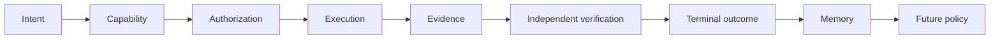
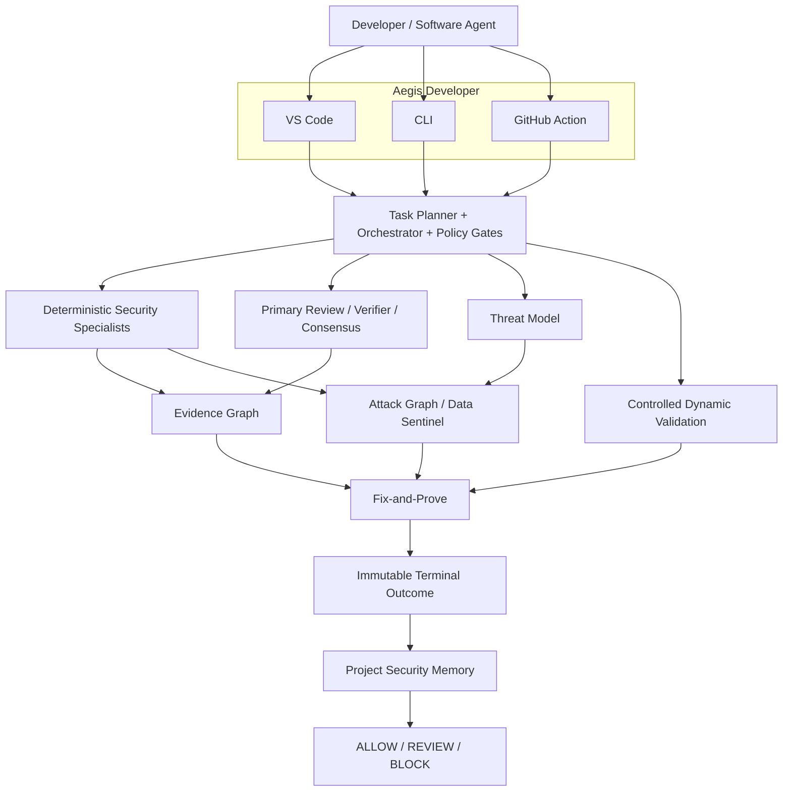
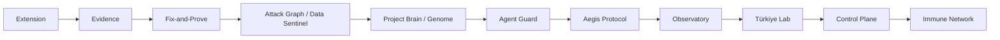

<p align="center">
  
</p>

<h2 class="repo-readme-title" align="center">Aegis</h2>

<p align="center">
  <strong>Trust infrastructure for software agents.</strong>
</p>

<p align="center">
  <em>Security claims need proof.</em>
</p>

<p align="center">
  Aegis turns security-sensitive software changes into an inspectable trust chain:
  <br>
  <strong>evidence → authorization → verification → remediation → outcome → memory.</strong>
</p>

<p align="center">
  <a href="https://marketplace.visualstudio.com/items?itemName=aegis-security.aegis-security">
    
  </a>
  
  
</p>

<p align="center">
  <a href="#overview">Overview</a>
  ·
  <a href="#what-ships-today">What ships today</a>
  ·
  <a href="#how-aegis-establishes-trust">Trust model</a>
  ·
  <a href="#product">Product</a>
  ·
  <a href="#architecture">Architecture</a>
  ·
  <a href="#the-aegis-ecosystem">Ecosystem</a>
  ·
  <a href="#quick-start">Quick start</a>
</p>

<br>

<p align="center">
  
</p>

<p align="center">
  <sub>Attack Graph / Data Sentinel in the Aegis VS Code extension. The numbers shown are from an intentionally vulnerable local demo repository, not product benchmarks.</sub>
</p>

---

## Overview

Software agents are becoming capable of writing code, editing repositories, calling tools, triggering CI, and proposing production changes at a speed that makes human review alone insufficient.

Aegis is built around a different question from a conventional scanner:

> **Can this security-sensitive action be trusted — and can Aegis show why?**

Aegis does not treat a model answer, scanner result, or successful patch application as proof by itself. It keeps the trust questions separate, records the evidence behind each one, and connects them into a durable security record.

At the product level, Aegis is a developer security system spanning **VS Code, CLI, GitHub Action, and a local orchestration backend**. At the architectural level, it is the first implementation of a broader trust layer for autonomous software agents.

### The core idea

A security claim should be able to answer all of these questions:

| Question | Aegis records |
| --- | --- |
| **What was requested?** | operation, repository revision, task graph, policy context |
| **Was it allowed?** | explicit authorization, scope, capability, execution limits |
| **What supports the claim?** | deterministic evidence, code locations, data flow, model review |
| **Was it independently checked?** | verifier route, verdict, confidence, route independence, consensus |
| **Is the attack path real?** | threat model, source→sink path, trust-boundary crossings, exploitability |
| **Did sensitive data actually flow?** | graph-proven Data Sentinel exposure |
| **Was the exact remediation authorized?** | immutable remediation manifest and patch digest |
| **Did the exact remediation work?** | project checks, static verification, regression analysis, authorized replay |
| **What happened at the end?** | committed / rolled back / rollback blocked terminal state |
| **Can the conclusion be trusted later?** | Evidence Graph, immutable outcome, project security memory, policy history |

The result is not simply a finding. It is an **inspectable trust chain**.

---

## What ships today

Aegis is already implemented across multiple security layers.

| Layer | Current capability |
| --- | --- |
| **Aegis Developer** | VS Code extension, CLI, GitHub Action, local backend |
| **Security Engine** | deterministic scanning, secrets, dependencies, configuration, attack-surface analysis |
| **Threat Modeling** | repository-aware threat-model artifacts derived from security context |
| **Evidence Graph** | canonical claims with provenance, evidence nodes, relationships, confidence, lifecycle state |
| **Independent Verification** | primary review, verifier review, route independence, deterministic consensus |
| **Fix-and-Prove** | explicit authorization, exact patch identity, verification, rollback semantics, immutable terminal outcomes |
| **Attack Graph** | deterministic materialization of source→sink attack paths and trust-boundary crossings |
| **Data Sentinel** | sensitive-data exposure only when the graph proves the flow |
| **Project Security Memory** | immutable snapshots and claim reconciliation across repository revisions |
| **Policy** | explicit `ALLOW`, `REVIEW`, and `BLOCK` decisions |

The public Marketplace package is a **preview**. The `main` branch may be ahead of the latest packaged Marketplace build between preview releases.

---

## How Aegis establishes trust

The system is designed around a sequence of explicit trust boundaries.



### 1. Evidence before conclusion

Aegis represents important security conclusions as **canonical claims**, not free-form model prose.

A claim can carry:

- stable claim identity
- category, severity, and confidence
- source locations
- CWE / OWASP mappings
- evidence nodes
- evidence provenance
- data-flow relationships
- lifecycle state
- remediation context
- verification relationships
- residual risk

Evidence relationships can express semantics such as `supports`, `contradicts`, `corroborates`, `derived_from`, `verifies`, and `mitigates`.

Invalid identities, broken references, incompatible relationships, and provenance mismatches fail closed rather than being silently normalized.

### 2. Authorization before security-sensitive execution

Analysis is not permission to execute code.

Aegis separates inspection from actions that can mutate a repository or execute repository-controlled behavior. Security-sensitive execution is gated by explicit authorization and bounded capabilities.

### 3. Independent verification before strong trust

Where model-backed analysis is enabled, Aegis can separate:

1. **primary security review**
2. **independent verifier review**
3. **deterministic consensus**

The trust record can preserve the provider/model for each role, route independence, verdict, confidence, reasons, and evidence.

A model is therefore an evidence source — **not the security authority**.

### 4. Exact remediation identity

Fix-and-Prove binds the authorized remediation to an exact patch identity.

The system tracks:

- the remediation plan
- the explicit authorization
- the exact patch digest
- the applied transaction
- verification artifacts
- dynamic validation artifact when required
- unified verdict
- terminal transaction state
- residual risk
- immutable terminal outcome

### 5. Memory after the run

Aegis persists security state across repository revisions instead of treating every scan as an unrelated event.

That makes future policy aware of whether a claim is new, persistent, changed, resolved, reopened, mitigated, or verified fixed.

---

## Product

## Evidence Graph

The Evidence Graph is the trust substrate underneath findings, threat models, remediation, and memory.

A canonical claim is meant to be answerable later:

- **What exactly is being claimed?**
- **Which artifact produced the claim?**
- **Which evidence supports or contradicts it?**
- **Which repository revision does it refer to?**
- **Was it verified independently?**
- **Was it mitigated?**
- **Was the mitigation itself verified?**

Claim state can express:

`SUSPECTED → SUPPORTED → CONFIRMED → MITIGATED → VERIFIED_FIXED`

with explicit alternatives such as `FALSE_POSITIVE`, `ACCEPTED_RISK`, and `INCONCLUSIVE`.

A failed or partial workflow is not persisted as a clean security baseline.

---

## Attack Graph

A vulnerability label is useful, but it is not an attack path.

Aegis materializes deterministic attack paths from the exact attack-surface and threat-model artifacts that produced them.

An attack path can preserve:

- exact source identity
- exact sink identity
- ordered graph steps
- trust-boundary crossings
- threat identity
- severity
- exploitability
- bounded confidence
- supporting evidence
- stable proof identity

The difference is important:

> **“Command injection exists”** is a finding.
> **“Attacker-controlled input reaches this process-execution sink through this exact path, crossing these boundaries, supported by this evidence”** is a proof-oriented security statement.

Attack Graph artifacts also carry provenance and deterministic digest boundaries so that later memory cannot quietly substitute a different source artifact.

---

## Data Sentinel

Data Sentinel is the sensitive-flow layer of the Attack Graph.

Its question is deliberately narrow:

> **Which classified data can reach which security-relevant sink on a graph-proven path?**

Aegis does not classify generic attacker input as a credential, secret, PII, or other sensitive class merely because the label would make the report more dramatic.

**No graph-proven sensitive flow → no Data Sentinel exposure claim.**

This makes Data Sentinel useful for reasoning about actual data exposure rather than broad keyword presence.

---

## Fix-and-Prove

Fix-and-Prove treats remediation as a security-sensitive transaction.

```text
plan
  ↓
explicit authorization
  ↓
exact patch + digest
  ↓
immutable pending manifest
  ↓
apply transaction
  ↓
project verification
  ↓
static verification
  ↓
regression analysis
  ↓
authorized dynamic replay when required
  ↓
unified verdict
  ↓
commit / rollback / rollback-blocked
  ↓
immutable terminal outcome
  ↓
Evidence Graph
  ↓
Project Security Memory
```

Aegis does **not** call a fix verified merely because:

- the file changed successfully
- one scanner stopped reporting a finding
- a model approved the patch
- one command returned zero
- dynamic replay was skipped when required
- the verification workflow itself failed

### Verification outcomes

| Outcome | Meaning |
| --- | --- |
| **VERIFIED** | the required evidence supports that the target is resolved without an unacceptable regression |
| **PARTIAL** | available checks passed, but the evidence is insufficient for a verified security claim |
| **FAILED** | the target remains, a required check failed, provenance drift occurred, a regression appeared, or execution could not support a trustworthy conclusion |

There is no demo-only success path. Incomplete evidence stays incomplete.

---

## Controlled dynamic validation

Dynamic validation is separately authorized because executing repository-controlled behavior is a different capability from reading code.

The local validation boundary is designed around:

- explicit authorization
- local-repository targets
- allowed test types
- fixed timeout
- CPU and memory limits
- networking disabled by default
- read-only repository mount
- read-only container root
- dropped Linux capabilities
- `no-new-privileges`
- unprivileged execution
- bounded output
- no shell-built container command

Dynamic evidence can confirm a threat, fail to reproduce it, be blocked by the safety boundary, or remain inconclusive.

**“Could not run” never becomes “safe”.**

---

## Project Security Memory

Security state should survive the current window, process, or model call.

Aegis stores immutable project snapshots and reconciles claims across repository revisions.

A reconciliation can classify a claim as:

- `new`
- `persistent`
- `changed`
- `resolved`
- `reopened`

Repository revision drift and source drift fail closed when trust depends on a stable source revision.

Only a legitimately committed and verified remediation lifecycle can become remembered `verified_fixed` state.

---

## Policy

Evidence becomes operational when policy can act on it.

Aegis produces explicit policy outcomes:

- **ALLOW** — configured policy accepts the current evidence and risk
- **REVIEW** — a person must resolve an active claim, incomplete evidence, or policy threshold
- **BLOCK** — a blocking condition exists or a required trust boundary could not be preserved

A blocked, cancelled, failed, or timed-out workflow never becomes proof of safety.

---

## Architecture

Aegis is organized around orchestration, evidence, controlled execution, and durable security state.



## Aegis Developer

The developer-facing product surfaces are:

- VS Code extension
- CLI
- GitHub Action
- local FastAPI backend

## Orchestration

Security work is represented as a task graph with explicit dependencies, artifact contracts, integrity checks, and policy gates.

This allows the workflow to be inspected before execution and audited after it.

## Security Engine

The engine combines deterministic specialists and explicitly bounded model-assisted reasoning for:

- static security evidence
- secrets
- dependencies
- configuration
- attack-surface mapping
- threat modeling
- Attack Graph construction
- controlled validation
- remediation verification

## Persistence

Aegis preserves:

- Evidence Graph records
- immutable remediation manifests
- immutable terminal outcomes
- audit records
- project security snapshots
- policy-relevant history

The goal is not simply to know what a tool said now, but to preserve **why that conclusion was trusted**.

---

## Security model

The architecture is governed by a small set of invariants.

1. **No evidence, no strong claim.**
2. **No authorization, no security-sensitive execution.**
3. **No exact provenance, no trusted artifact.**
4. **No completed verification, no `verified_fixed`.**
5. **No stable repository revision, no durable trust conclusion.**
6. **No single model is the source of truth.**
7. **Failure, cancellation, skipped execution, and timeout never imply safety.**
8. **Terminal remediation truth is immutable.**
9. **Memory preserves uncertainty instead of erasing it.**
10. **Least privilege is a system property, not a prompt instruction.**

### Fail-closed behavior

Aegis is designed to stop or downgrade the trust conclusion when it encounters conditions such as:

- revision drift
- source drift
- provenance mismatch
- missing required artifacts
- duplicate artifact identity
- incompatible evidence relationships
- failed project verification
- failed regression checks
- required dynamic validation that did not run
- rollback state that cannot support a successful remediation claim

---

## Product surfaces

## VS Code

The extension is the interactive Aegis workspace.

It can:

- scan a selection, file, Git change set, dependency set, or workspace
- map repository attack surface
- generate a threat model
- materialize Attack Graph / Data Sentinel
- display canonical claims and evidence nodes
- show primary/verifier routes and deterministic consensus
- preview security task graphs
- request explicit authorization for controlled execution
- preview secure fixes
- run verification and report incomplete evidence honestly
- expose policy, memory, audit, and integrity information

Repository commands are gated by VS Code Workspace Trust.

## CLI

The CLI exposes deterministic and orchestration-oriented workflows for local development, scripting, and release validation.

It shares the same backend trust contracts rather than implementing a separate security model.

## GitHub Action

The Action provides a pull-request security gate without executing repository code.

It can emit policy evidence, change-gate output, and SARIF.

```yaml
name: Aegis

on:
  pull_request:

permissions:
  contents: read
  security-events: write

jobs:
  aegis:
    runs-on: ubuntu-latest
    steps:
      - uses: actions/checkout@v6
        with:
          fetch-depth: 0

      - uses: lemkyz/Aegis@v0.2.0
        with:
          base: ${{ github.event.pull_request.base.sha }}
          head: ${{ github.event.pull_request.head.sha }}
```

For production use, pin Aegis to a published release tag or immutable commit.

## Local backend

The FastAPI backend is the orchestration and trust engine behind the developer surfaces.

It coordinates:

- deterministic specialists
- model routes
- evidence construction
- threat modeling
- Attack Graph
- validation
- secure remediation
- verification
- lifecycle outcomes
- memory
- policy
- audit
- integrity verification

---

## The Aegis ecosystem

Aegis starts with software security because security-sensitive code changes are a concrete place to prove the trust architecture.

The longer-term problem is larger:

> **Autonomous software agents should be permissioned, least-privilege, monitored, explainable, evidence-backed, independently verifiable, reversible, and remembered.**



## Available today

- **Aegis Developer**
- **Security Engine**
- **Evidence Graph**
- **Independent Verification**
- **Fix-and-Prove**
- **Attack Graph / Data Sentinel**
- **Project Security Memory**
- **Policy**

## Next: Project Brain / Genome

The next product layer moves from isolated findings and snapshots toward durable repository understanding:

- architecture and component identity
- security posture
- change semantics
- historical context
- repository constraints
- long-lived agent memory
- structured understanding of what the project *is*, not just what one scan found

## Ecosystem direction

### Agent Guard

Capability-aware control before a software agent touches repositories, processes, networks, secrets, infrastructure, or deployment systems.

### Aegis Protocol

Portable trust claims, attestations, provenance, and verification exchange between tools and agents.

### Observatory

Cross-run and cross-agent visibility into trust state, unresolved risk, verification history, and policy outcomes.

### Türkiye Lab

Applied research, validation, and regional trust-infrastructure work.

### Control Plane

Organization-wide identity, capability, policy, governance, audit, and agent oversight.

### Immune Network

A future distributed layer for learning from verified attack and defense evidence without reducing trust to opaque model intuition.

These later layers are **architectural direction**, not a claim that every ecosystem component has already shipped.

---

## Why Aegis is different

Aegis is not trying to build defensibility around one rule, one scanner, or one model.

Those components can change.

The durable object is the trust record:

```text
claim
+ evidence
+ provenance
+ authorization
+ independent verification
+ exact remediation identity
+ terminal outcome
+ durable memory
= trust that can be inspected later
```

That architecture is intended to remain useful even as models, scanners, agent frameworks, and development environments evolve.

---

## Quick start

## Install the VS Code preview

Marketplace:

**https://marketplace.visualstudio.com/items?itemName=aegis-security.aegis-security**

Or install from a terminal with VS Code available:

```bash
code --install-extension aegis-security.aegis-security
```

## Run the local backend

Requirements:

- Python 3.14
- Semgrep
- Podman or Docker only for explicitly authorized dynamic validation

```bash
git clone https://github.com/lemkyz/Aegis.git
cd Aegis/backend

python -m venv .venv
source .venv/bin/activate
pip install -e ".[dev]"

export AEGIS_FINGERPRINT_KEY="$(
  python -c 'import secrets; print(secrets.token_urlsafe(48))'
)"

uvicorn aegis.main:app \
  --host 127.0.0.1 \
  --port 8000
```

Health check:

```bash
curl http://127.0.0.1:8000/health
```

The extension uses `http://127.0.0.1:8000` by default.

Deterministic workflows do not require a model provider. Configure primary and verifier routes deliberately for model-backed review using `backend/.env.example`.

---

## Data and permission boundaries

Aegis handles source code and security evidence as sensitive material.

Current preview boundaries include:

- local deterministic scanning
- local project security memory
- local policy evaluation
- local audit records
- explicit provider configuration for model-backed review
- secret redaction before configured provider calls
- provider/model identity recorded in reports
- Workspace Trust gating for repository actions
- explicit authorization for dynamic execution
- read-only and network-restricted validation defaults
- exact patch-digest binding for secure fixes
- atomic source replacement
- rollback protection against overwriting newer user work

Use dynamic validation only on repositories and systems you own or are explicitly authorized to test.

---

## Repository structure

```text
Aegis/
├── backend/
│   ├── aegis/
│   │   ├── orchestrator/     # task planning, handlers, execution, integrity
│   │   ├── schemas/          # strict security and trust contracts
│   │   └── security/         # scanners, graphs, policy, memory, validation
│   └── tests/                # unit, contract, integration, acceptance
├── extension/
│   ├── src/                  # VS Code product surface
│   ├── test/                 # extension contracts
│   └── dist/                 # packaged extension output
├── security-engine/rules/    # deterministic security rules
├── docs/                     # architecture and release documentation
├── examples/                 # safe examples and fixtures
├── .github/                  # CI and repository automation
├── action.yml
├── SECURITY.md
└── README.md
```

---

## Development

## Backend

Run the canonical backend suite from `backend/`:

```bash
.venv/bin/python -m pytest -q
```

## Extension

```bash
cd extension
npm test
```

## Release readiness

From the repository root:

```bash
./scripts/run-release-readiness.sh
```

The repository contains gates for backend contracts and regressions, real-repository acceptance workflows, API smoke validation, installed package scenarios, extension compile/contracts, VSIX packaging, and repository diff integrity.

Security-sensitive changes should prove the trust property being preserved — not merely the happy-path output.

---

## Status

Aegis is a **preview**.

It is intended for evaluation on local and non-production repositories while public interfaces continue to evolve before `1.0`.

The current system already connects:

**analysis → evidence → authorization → independent verification → remediation → attack paths → terminal outcome → memory → policy**

The next major product layer is **Project Brain / Genome**.

---

## Contributing

Read [`CONTRIBUTING.md`](CONTRIBUTING.md) before proposing changes.

For security-sensitive changes, tests should demonstrate the trust property being preserved.

## Security

Read [`SECURITY.md`](SECURITY.md) for vulnerability reporting and security guidance.

Do not use Aegis dynamic validation against systems you do not own or have explicit permission to test.

## License

Apache License 2.0.

See [`LICENSE`](LICENSE) and [`NOTICE`](NOTICE).

---

<p align="center">
  <strong>Aegis</strong><br>
  <em>Security claims need proof.</em>
</p>
